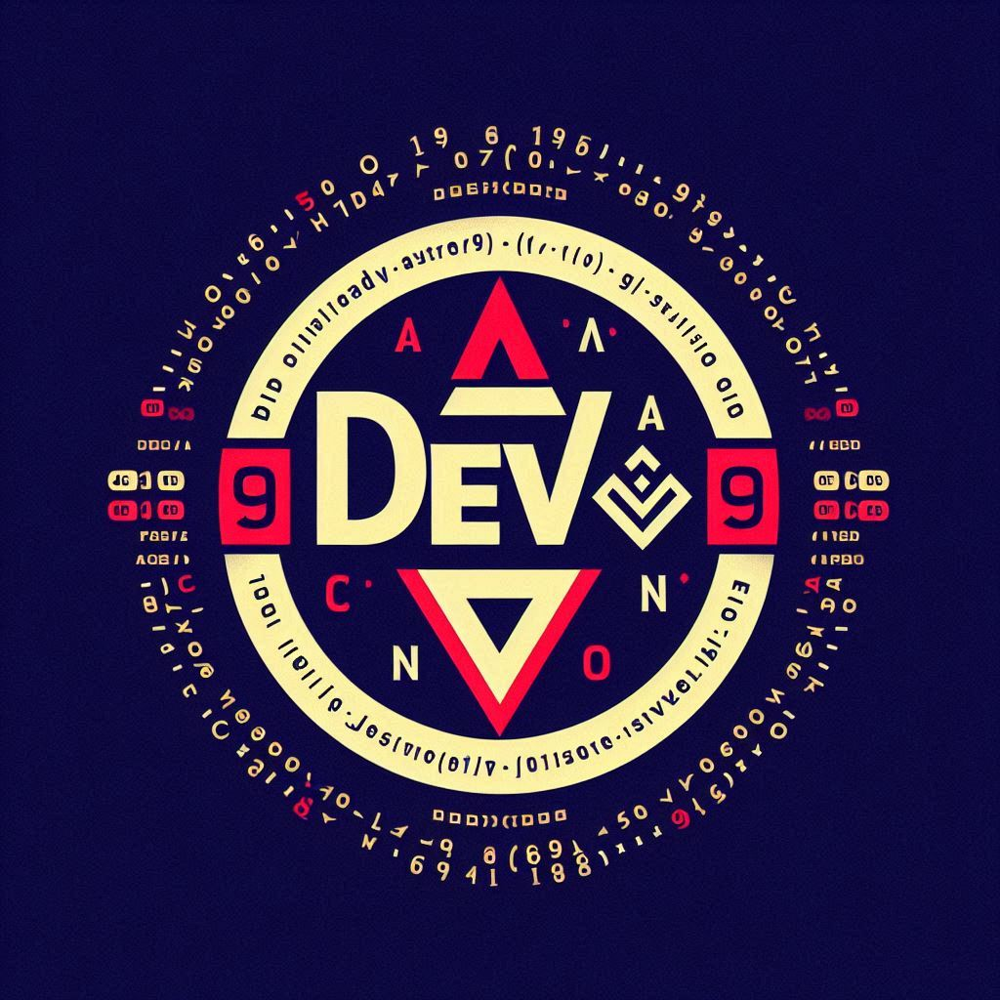

# **DevArsenal** ⚡️

<p align="center">
  
</p>


**DevArsenal** is the ultimate *toolkit* for JavaScript developers who want to level up their coding game. Packed with a suite of powerful, reusable utilities, **DevArsenal** cuts down the time you spend on repetitive tasks and supercharges your workflow. Whether you're wrangling arrays, manipulating objects, or handling APIs, DevArsenal has got your back!

### **Why DevArsenal?**
Think of **DevArsenal** as your trusty coding sidekick—the one that handles the grunt work so you can focus on what really matters. From simple array manipulations to complex object handling, this library has everything you need to become a development wizard. ✨

### **Features** 🌟
- **Array Sorcery**: Transform arrays effortlessly with functions like `chunk`, `flatten`, and `filterUnique`. Wave goodbye to the hassle of handling arrays manually!
- **Object Wizardry**: Master deep cloning, object merging, and property manipulation like a pro.
- **String Alchemy**: Breeze through string tasks with helpers for trimming, padding, casing, and more.
- **API Magic**: Simplify your API requests and responses with easy-to-use wrappers. API calls have never been this smooth!
- **Async Sorcery**: Conquer async tasks with concurrency control and promise helpers that make your asynchronous code a walk in the park.
- **File System Hacks**: Handle file system operations with ease—because your filesystem shouldn’t feel like a maze.
- **CLI Power-ups**: Boost your terminal game with handy CLI utilities that make your command-line life easier.

### **Getting Started: Let’s Do This!**
Ready to start working smarter? It’s simple—just install **DevArsenal** and you’re good to go (for now, at least 😉).

```bash
npm install devarsenal
```

### **Usage Example**
Here’s how you can unleash the power of **DevArsenal** in your project:

```javascript
const { chunkArray, mergeObjects } = require('devarsenal');

// Chunk array into smaller pieces
const arr = [1, 2, 3, 4, 5, 6];
const chunked = chunkArray(arr, 2);  // [[1, 2], [3, 4], [5, 6]]

// Merge two objects
const obj1 = { a: 1, b: 2 };
const obj2 = { b: 3, c: 4 };
const merged = mergeObjects(obj1, obj2);  // { a: 1, b: 3, c: 4 }
```

### **Coming Soon: The NPM Package** 🏎️💨
Hold on tight, because **DevArsenal** is about to hit NPM soon! That’s right—this toolkit will be available as an NPM package, so you can easily bring it into your projects with just a simple `npm install`. It’s going to make object and array manipulation *ridiculously* easy—and *way* more fun. Stay tuned! 🚀

### **Contributing: Be Part of the Fun!**
We love to see new contributors! Fork the repo, submit a pull request, and make sure to stick to the JavaScript style guide. Bonus points for clear and witty commit messages—because coding should be fun, right?

